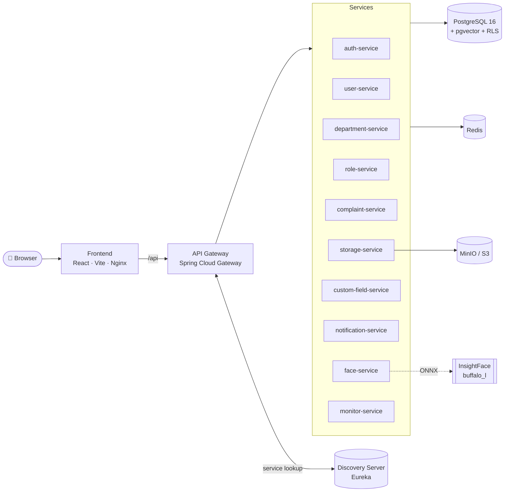

<div align="center">

# 🛡️ ProctorAI

**An AI-assisted complaint, identity, and access-management platform built on reactive microservices.**

Face recognition · Fine-grained RBAC with row-level security · Real-time notifications · One-command setup

<br />


<br />


[Features](#-features) · [Architecture](#-architecture) · [Quick Start](#-quick-start) · [Services](#-services) · [Configuration](#%EF%B8%8F-configuration) · [API](#-api-overview)

</div>

---

## ✨ Features

| | Feature | Description |
|---|---|---|
| 🧑‍🤝‍🧑 | **User management** | Create, edit, and bulk-import users from CSV, with configurable table columns and custom fields. |
| 🏢 | **Departments** | Organise people into departments; permission scopes respect department membership. |
| 🔐 | **Roles & permissions** | A permission matrix over `entity × action × scope` (`own` / `department` / `all`), enforced in the database with PostgreSQL **Row-Level Security**. |
| 📝 | **Complaints** | Full lifecycle: create, assign, change status, comment, attach files, and view history. |
| 🧠 | **Face recognition** | SCRFD detection + ArcFace 512-d embeddings via ONNX Runtime, searched with **pgvector**. Supports enrollment, bulk import, live recognition, and an audit trail. |
| 📎 | **File storage** | Presigned uploads and downloads against S3-compatible storage (MinIO). |
| 🔔 | **Real-time notifications** | Streamed in-app notifications, user preferences, device registration, and optional FCM push. |
| 🧩 | **Custom fields** | Admin-defined fields that attach to platform entities without schema changes. |
| 📊 | **System monitor** | A live view of service health, overview stats, and infrastructure status. |
| 🎨 | **Modern UI** | React 19 + Tailwind CSS 4 + shadcn/ui with a command palette, dark mode, and smooth motion. |

---

## 🏗️ Architecture



**Key design decisions**

- **Reactive end to end.** The services run on Spring WebFlux and R2DBC, which keeps them non-blocking under load.
- **Security in the database.** Authorization is enforced by PostgreSQL RLS policies and `can_access(...)` security functions. A service bug cannot bypass it.
- **Shared libraries.** The `common-*` modules hold the cross-cutting code for security, persistence, storage, notifications, custom fields, and monitoring.
- **Stateless auth.** Short-lived JWT access tokens are paired with rotating refresh tokens in secure cookies.

---

## 🚀 Quick Start

> **Prerequisite:** only [Docker](https://docs.docker.com/get-docker/) with Compose v2. You don't need Java, Node, or Postgres installed locally.

```bash
git clone https://github.com/vishaltyagi807/Proctor-AI.git
cd Proctor-AI
./setup.sh
```

The setup script handles everything on the first run:

1. ✅ Checks the Docker and Compose versions
2. 🔑 Generates `backend/.env` with fresh random secrets
3. 🧠 Downloads the InsightFace face models (≈280 MB, one time only)
4. 🔌 Verifies that the required ports are free
5. 🐳 Builds and starts the full stack, then prints the URLs

Once it's running:

| Service | URL |
|---|---|
| 🌐 Web app | http://localhost:5173 |
| 🚪 API gateway | http://localhost:7050 |
| 🧭 Service registry | http://localhost:8761 |
| 🗄️ MinIO console | http://localhost:9201 |

> 🔑 The seeded admin account is printed at the end of setup. Its password is in `backend/init/07_seed.sql`.

### Setup commands

```bash
./setup.sh              # set up and start the development stack (default)
./setup.sh prod         # set up and start the production stack
./setup.sh status       # show every container and its health
./setup.sh logs api-gateway   # follow logs for a service
./setup.sh stop         # stop containers, keep data
./setup.sh down         # remove containers, keep data
./setup.sh help         # show all options
```

Add `--prod` to `stop`, `down`, `status`, or `logs` to act on the production stack.

> 💡 In development, frontend edits hot-reload instantly. After backend changes, run `./setup.sh` again.

---

## 🧱 Services

| Service | Port | Responsibility |
|---|:---:|---|
| `discovery-server` | 8761 | Eureka service registry |
| `api-gateway` | 7050 | Routing, CORS, and load balancing |
| `auth-service` | 7051 | Login, logout, token refresh, sessions |
| `user-service` | 7052 | Users, profiles, bulk CSV import |
| `department-service` | 7053 | Departments and memberships |
| `role-service` | 7054 | Roles and the permission matrix |
| `complaint-service` | 7055 | Complaints, comments, assignment, history |
| `storage-service` | 7056 | Presigned S3 uploads and downloads |
| `custom-field-service` | 7057 | Dynamic custom field definitions |
| `notification-service` | 7058 | Real-time notifications, preferences, FCM |
| `face-service` | 7059 | Face detection, enrollment, and recognition |
| `monitor-service` | 7060 | System health and overview stats |

**Infrastructure:** PostgreSQL 16 + pgvector · Redis 7.4 · MinIO

---

## 📁 Project Structure

```
ProctorAI/
├── setup.sh                     # one-command setup & lifecycle script
├── backend/
│   ├── docker-compose.yaml      # development stack
│   ├── docker-compose.prod.yaml # production stack
│   ├── init/                    # Postgres schema, RLS, functions, triggers, seed
│   ├── common-*/                # shared libraries
│   ├── *-service/               # microservices
│   ├── api-gateway/
│   ├── discovery-server/
│   ├── postman/                 # Postman collection & environments
│   └── seed-data/               # sample CSV for bulk import
└── frontend/
    ├── src/
    │   ├── routes/              # TanStack Router routes
    │   ├── components/          # feature & UI components (shadcn/ui)
    │   ├── lib/                 # API client, session, permissions, queries
    │   └── hooks/
    ├── Dockerfile
    └── nginx.conf
```

---

## ⚙️ Configuration

`./setup.sh` generates the environment files automatically:

- **Development:** `backend/.env`
- **Production:** `backend/.env.production`

See `backend/.env.example` for the full list. The most important variables are:

| Variable | Purpose |
|---|---|
| `JWT_SECRET`, `JWT_ISSUER` | Token signing |
| `JWT_ACCESS_EXPIRE_IN_SEC` / `JWT_REFRESH_EXPIRE_IN_SEC` | Token lifetimes (defaults: 15 min / 30 days) |
| `APP_ALLOWED_ORIGINS` | Allowed CORS origins |
| `APP_COOKIE_SECURE` | Set `true` behind HTTPS |
| `S3_PUBLIC_ENDPOINT` | File URL that browsers can reach |
| `FACE_MATCH_THRESHOLD` | Cosine similarity threshold for a face match |
| `FACE_DETECTION_SCORE_THRESHOLD` | Minimum face detection confidence |

Host ports can be overridden with `FRONTEND_PORT`, `GATEWAY_SERVER_PORT`, and `DISCOVERY_SERVER_PORT` in development, and with `HTTP_PORT` in production.

> ⚠️ **Before going live**, set `APP_ALLOWED_ORIGINS` to your site URL and `S3_PUBLIC_ENDPOINT` to a public file URL in `backend/.env.production`.

### Database

The database schema, RLS policies, security functions, triggers, and seed data live in `backend/init/` and are applied automatically when Postgres starts for the first time.

| File | Contents |
|---|---|
| `01_create_roles.sh` | Database roles |
| `02_extensions.sql` | Extensions (pgvector and others) |
| `03_schema.sql` | Tables and types |
| `04_security_functions.sql` | `can_access`, `has_scope`, and related functions |
| `05_rls_policies.sql` | Row-level security policies |
| `06*_*.sql` | Triggers and domain functions |
| `07_seed.sql` | Permissions, roles, and the admin user |
| `08_grants.sql` | Privileges |

---

## 🧠 Face Recognition

The `face-service` runs entirely **on-premises** without calling any external AI API.

- **Detection:** SCRFD-10G (`det_10g.onnx`) with 5-point landmarks
- **Embedding:** ArcFace R50 (`w600k_r50.onnx`) producing 512-d L2-normalised vectors
- **Search:** pgvector cosine similarity through Spring AI's `VectorStore`
- **Access control:** separate permissions for recognition, live recognition, match details, enrollment lock, import, and audit
- **Abuse protection:** self-enrollment is capped, and a privileged user must unlock it

`./setup.sh` downloads the models automatically. For details, see [`backend/face-service/README.md`](backend/face-service/README.md).

---

## 🔌 API Overview

All requests go through the gateway at `http://localhost:7050`.

| Prefix | Service | Examples |
|---|---|---|
| `/auth` | auth | `POST /login`, `POST /refresh`, `POST /logout-all` |
| `/users` | user | `GET /me`, `GET /me/permissions`, `POST /bulk` |
| `/departments` | department | `GET /{id}/members`, `PUT /{id}/members` |
| `/roles` | role | `GET /{id}/permissions`, `PATCH /{id}/permissions` |
| `/complaints` | complaint | `PUT /{id}/status`, `PUT /{id}/assignee`, `GET /{id}/history` |
| `/complaints/{id}/files` | storage | `POST /upload-url`, `GET /{fileId}/download-url` |
| `/custom-fields` | custom-field | `GET /applicable` |
| `/notifications` | notification | `GET /unread-count`, `POST /read-all`, `PUT /preferences` |
| `/faces` | face | `POST /recognize`, `POST /enroll/{userId}`, `GET /audit` |
| `/system` | monitor | `GET /overview`, `GET /stats` |

📮 A ready-to-use **Postman collection** with dev and production environments is available in [`backend/postman/`](backend/postman).

---

## 🛠️ Tech Stack

<table>
<tr>
<td valign="top" width="50%">

**Backend**
- Java 21, Spring Boot 3.5, Spring WebFlux
- Spring Cloud Gateway and Netflix Eureka
- R2DBC with PostgreSQL 16 and pgvector
- Spring AI `VectorStore`
- ONNX Runtime with InsightFace models
- Redis, MinIO (S3)
- Lombok, MapStruct, Gradle (Kotlin DSL)

</td>
<td valign="top" width="50%">

**Frontend**
- React 19, TypeScript 6, Vite 8
- TanStack Router and TanStack Query
- Tailwind CSS 4, shadcn/ui, Base UI
- Motion, Recharts, cmdk, Lucide
- Served by Nginx in production

</td>
</tr>
</table>

---

## 📄 License

Released under the [MIT License](LICENSE). © 2026 Varshit Tyagi.

<div align="center">
<br />

Made with ❤️ by **Varshit Tyagi**

⭐ Star this repo if you find it useful!

</div>
