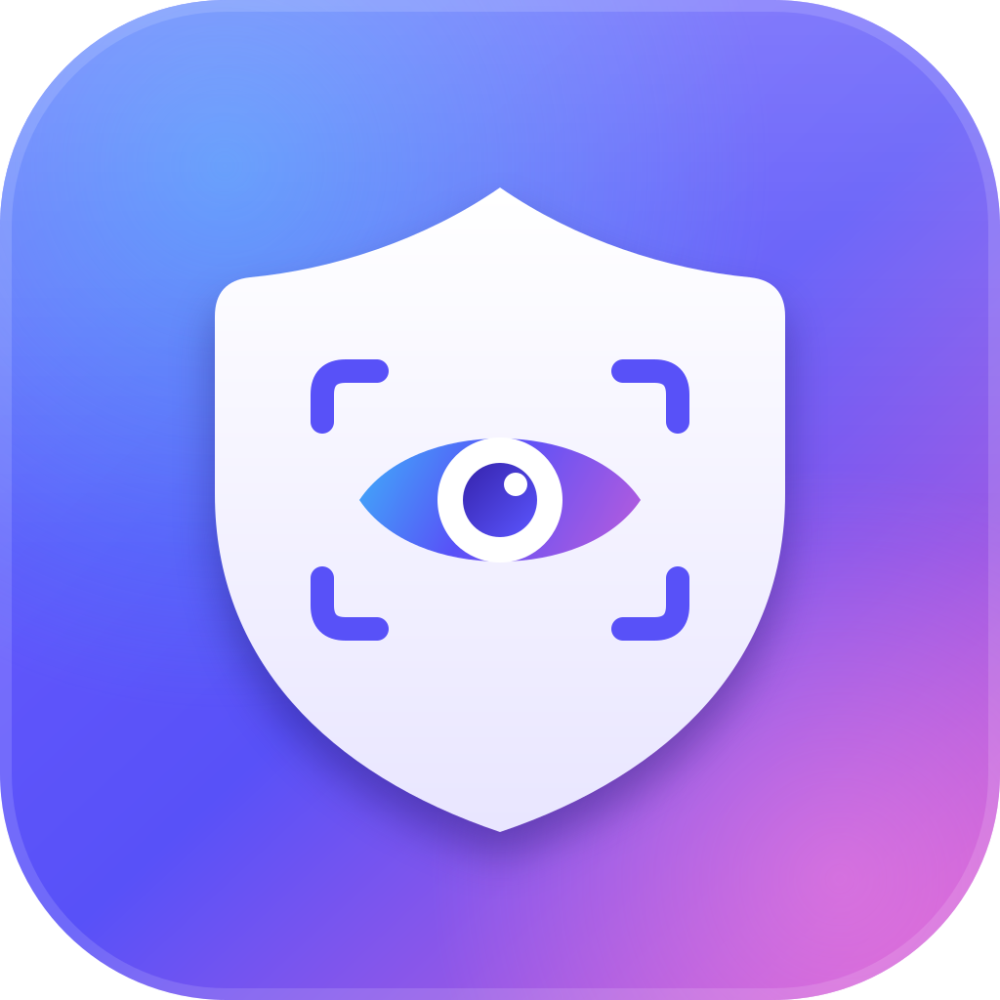
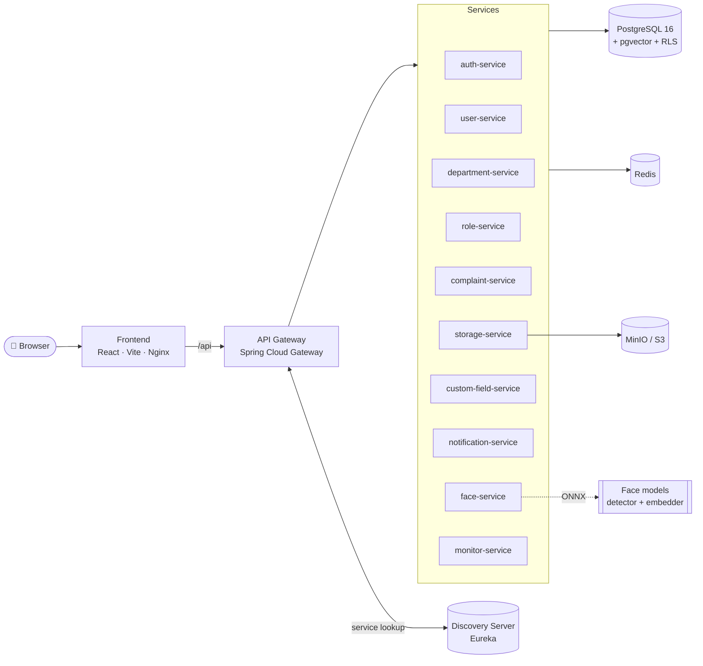

<div align="center">



# ProctorAI

**An AI-assisted complaint, identity, and access-management platform built on reactive microservices.**

Face recognition · Fine-grained RBAC with row-level security · Real-time notifications · Web, desktop and mobile · One-command setup

<br />


<br />


<br />


[Platforms](#-supported-platforms) · [Get Started](#-get-started) · [Features](#-features) · [Production](#-production-deployment) · [Apps](#-desktop-and-mobile-apps) · [Architecture](#%EF%B8%8F-architecture) · [Configuration](#%EF%B8%8F-configuration) · [API](#-api-overview) · [Full Guide](GUIDE.md)

</div>

---

## 🌐 Supported Platforms

ProctorAI runs everywhere your users are. The web app and the native apps share one codebase, with the same features and the same server.

| Platform | Minimum version | Architectures | Package | How users get it |
|---|---|---|---|---|
| 🌐 **Web** | Chrome / Edge 111+, Firefox 128+, Safari 16.4+ | Any | Browser, with **Add to Home Screen** | Open the server's web address |
| 🪟 **Windows** | Windows 10 and 11 | x64 | `.exe` installer, `.msi` | Download and run the installer |
| 🍎 **macOS** | macOS 13 Ventura | Apple Silicon and Intel (universal) | `.dmg`, `.app` | Open the disk image and drag to Applications |
| 🐧 **Linux** | Ubuntu 22.04+, Debian 12+, Fedora 36+, or any distribution with WebKitGTK 4.1 | x64 | `.deb`, `.rpm`, `.AppImage` | Install the package for the distribution, or run the AppImage |
| 🤖 **Android** | Android 8.0 (API 26) | arm64, armv7, x86, x86_64 | `.apk`, `.aab` | Install the APK, or publish the AAB on Google Play |
| 📱 **iOS** | iOS 16.4 | arm64 | `.ipa` | TestFlight or the App Store |

**Native app extras** (Windows, macOS, Linux, Android, iOS):

- System notifications while the app is in the background
- `proctorai://` deep links. On desktop, a second launch focuses the open window.
- Native save dialogs, and the camera for face recognition
- Layouts that respect notches, rounded corners and system bars on phones
- A server address chosen at sign-in, or built into the app

**Server:** any 64-bit Linux server (x86_64) with Docker 25+ and Compose 2.21+. Developers can also run the full stack on macOS and Windows with Docker Desktop.

---

## 🚀 Get Started

Pick the path that matches what you want to do. Each one needs only **[Docker](https://docs.docker.com/get-docker/)**, except building the apps. New machine with nothing installed? **[GUIDE.md](GUIDE.md)** walks through installing everything, step by step, for Linux, macOS and Windows.

### ⚡ 1. Fastest: run the published images

Every service is prebuilt on Docker Hub ([`vishaltyagi807/proctor-ai`](https://hub.docker.com/r/vishaltyagi807/proctor-ai)). Nothing is compiled, so a server is up in about five minutes.

```bash
git clone --depth 1 https://github.com/vishaltyagi807/Proctor-AI.git
cd Proctor-AI/docker
./setup.sh
```

You only need the `docker/` folder, so you can also copy just that folder to a server. Setup creates the secrets, asks for your domains, sets up HTTPS, pulls the images and starts everything. It then shows a **one-time administrator password** for `admin@college.com`. See [`docker/README.md`](docker/README.md).

### 🛠️ 2. Develop: run from source

```bash
git clone https://github.com/vishaltyagi807/Proctor-AI.git
cd Proctor-AI
./setup.sh
```

The first run takes a few minutes. Setup creates `backend/.env`, downloads the face recognition models (≈190 MB, once), then builds and starts the stack:

| Service | URL |
|---|---|
| 🌐 Web app | http://localhost:5173 |
| 🚪 API gateway | http://localhost:7050 |
| 🧭 Service registry | http://localhost:8761 (user `proctor-discovery`, password `DISCOVERY_PASSWORD` in `backend/.env`) |
| 🗄️ MinIO console | http://localhost:9201 |

Sign in with the default administrator account:

| Email | Password |
|---|---|
| `admin@college.com` | `admin123` |

> ⚠️ `admin123` is the public development default. Change it after signing in on any machine others can reach. Deployments from the published images (path 1) replace it with a random password automatically.

Frontend edits reload instantly. After backend changes, run `./setup.sh` again. To run your own build in production, use `./setup.sh prod` (see [Production Deployment](#-production-deployment)).

### 📱 3. Build the desktop and mobile apps

```bash
./native-doctor.sh          # checks your machine and prints the install command for anything missing
cd frontend && npm ci
npm run tauri:build         # desktop installers for this OS
npm run tauri:android:build # Android APK / AAB
npm run tauri:ios:build     # iOS (on a Mac)
```

See [Desktop and Mobile Apps](#-desktop-and-mobile-apps) and section 6 of the [guide](GUIDE.md#6-desktop-and-mobile-apps).

### Setup commands

| Published images (`docker/setup.sh`) | From source (`./setup.sh`) | Does |
|---|---|---|
| `./setup.sh` | `./setup.sh` / `./setup.sh prod` | Set up and start (development / production) |
| `./setup.sh update [version]` | `./setup.sh prod --yes` | Update to new images / rebuild from your code |
| `./setup.sh dns` | `./setup.sh dns` | Show DNS records and whether they are in place |
| `./setup.sh status` | `./setup.sh status [--prod]` | Show every container and its health |
| `./setup.sh logs [service]` | `./setup.sh logs [--prod] [service]` | Follow logs |
| `./setup.sh stop` / `down` | `./setup.sh stop` / `down [--prod]` | Stop or remove containers, keeping data |
| `./setup.sh purge` | `./setup.sh purge [--prod]` | Delete everything, including data (asks to confirm) |

To free disk space, `./clean-up.sh` deletes the build output (`build/`, `.gradle/`, `src-tauri/target`), `node_modules` and the backend `.env` files. Run `./clean-up.sh --dry-run` first to see the list.

---

## ✨ Features

| | Feature | Description |
|---|---|---|
| 🧑‍🤝‍🧑 | **User management** | Create, edit, and bulk-import users from CSV, with configurable table columns and custom fields. |
| 🏢 | **Departments** | Organise people into departments; permission scopes respect department membership. |
| 🔐 | **Roles & permissions** | A permission matrix over `entity × action × scope` (`own` / `department` / `all`), enforced in the database with PostgreSQL **Row-Level Security**. |
| 📝 | **Complaints** | Full lifecycle: create, assign, change status, comment, attach files, and view history. |
| 🧠 | **Face recognition** | SCRFD detection + ArcFace 512-d embeddings via ONNX Runtime, searched with **pgvector**. Supports enrollment, bulk import, live recognition, and an audit trail. |
| 📎 | **File storage** | Presigned uploads and downloads against S3-compatible storage (MinIO). |
| 🔔 | **Real-time notifications** | Streamed in-app notifications, user preferences, device registration, and optional FCM push. |
| 🧩 | **Custom fields** | Admin-defined fields that attach to platform entities without schema changes. |
| 📊 | **System monitor** | A live view of service health, overview stats, and infrastructure status. |
| 🎨 | **Modern UI** | React 19 + Tailwind CSS 4 + shadcn/ui with a command palette, dark mode, and smooth motion. |

---

## 🏗️ Architecture



**Key design decisions**

- **Reactive end to end.** The services run on Spring WebFlux and R2DBC, which keeps them non-blocking under load.
- **Security in the database.** Authorization is enforced by PostgreSQL RLS policies and `can_access(...)` security functions. A service bug cannot bypass it.
- **Shared libraries.** The `common-*` modules hold the cross-cutting code for security, persistence, storage, notifications, custom fields, and monitoring.
- **Stateless auth.** Short-lived JWT access tokens are paired with rotating refresh tokens in secure cookies.

---

## 🌍 Production Deployment

Run either of these on a Linux server with Docker and a public IP address. Both ask the same questions and configure the same hardened stack:

| | Command | Use when |
|---|---|---|
| ⚡ Published images | `cd docker && ./setup.sh` | You want the released version, fast (recommended) |
| 🏗️ From source | `./setup.sh prod` | You want to run your own changes |

Setup asks for three domains and a contact email, then configures everything else on its own:

| Prompt | Example | Serves |
|---|---|---|
| Web app domain | `app.example.com` | The web app and its API |
| File storage domain | `files.example.com` | Uploads and downloads (MinIO behind presigned URLs) |
| Service registry domain | `registry.example.com` | The Eureka dashboard, behind a password |
| Certificate email | `ops@example.com` | Let's Encrypt expiry notices |

**What happens automatically**

1. The server's public IP address is detected.
2. The domains are checked against public DNS.
3. A [Caddy](https://caddyserver.com) edge proxy is configured. It obtains and renews TLS certificates from Let's Encrypt (with ZeroSSL as a fallback), redirects HTTP to HTTPS, sends HSTS headers and serves HTTP/3.
4. The allowed CORS origins, secure cookies, presigned file URLs and MinIO CORS are set to match, and updated again on every run (see below).
5. The stack is pulled (or built) and started, and setup waits until every certificate is active.
6. With the published images, the default administrator password is replaced with a random one and shown once.

**Add these DNS records** (setup prints them with your real IP address and the status of each one):

| Type | Name | Value |
|---|---|---|
| A | `app.example.com` | your server's public IPv4 address |
| A | `files.example.com` | your server's public IPv4 address |
| A | `registry.example.com` | your server's public IPv4 address |
| CAA (optional) | `example.com` | `0 issue "letsencrypt.org"` |

Also allow inbound **TCP 80**, **TCP 443** and **UDP 443** in your firewall or cloud security group.

**Before DNS is ready**, the app runs from the IP address so you can start using it right away:

| Part | Before DNS | After DNS |
|---|---|---|
| Web app | `http://<server-ip>` | `https://app.example.com` |
| File storage | `http://<server-ip>:9200` | `https://files.example.com` |
| Service registry | SSH tunnel to `http://localhost:8761` | `https://registry.example.com` |

Check propagation with `./setup.sh dns`, then run setup again (`./setup.sh` in `docker/`, or `./setup.sh prod`) to switch to HTTPS. On reruns, press Enter to keep the saved domains. You can also pass `--yes` to skip the prompts, or set `APP_DOMAIN`, `FILES_DOMAIN`, `REGISTRY_DOMAIN`, `ACME_EMAIL` and `PUBLIC_IP` for unattended installs.

> 🔒 The IP stage is plain HTTP and meant only for the time until DNS is set. The service registry and the MinIO console are never exposed over plain HTTP. Reach them with `ssh -L 8761:127.0.0.1:8761 -L 9201:127.0.0.1:9201 <user>@<server-ip>`.

---

## 📱 Desktop and Mobile Apps

The same React app ships as native apps through **Tauri 2**. See [Supported Platforms](#-supported-platforms) for versions and packages. Each app is built on this kind of machine:

| App | Build on |
|---|---|
| 🪟 Windows | Windows |
| 🍎 macOS | macOS |
| 🐧 Linux | Linux |
| 🤖 Android | Linux, macOS or Windows |
| 📱 iOS | macOS with Xcode |

The apps connect to any ProctorAI server. Build one in with `VITE_SERVER_URL=https://app.example.com`, or let users enter the address at sign-in. They support live updates, system notifications, the camera for face recognition, native downloads, `proctorai://` deep links and safe areas on phones. Setup already allows the app origins on the server.

Run `./native-doctor.sh` to see what your machine still needs, then follow section 6 of [GUIDE.md](GUIDE.md#6-desktop-and-mobile-apps) for development, release builds, signing and store uploads.

---

## 🧱 Services

| Service | Port | Responsibility |
|---|:---:|---|
| `discovery-server` | 8761 | Eureka service registry |
| `api-gateway` | 7050 | Routing, CORS, and load balancing |
| `auth-service` | 7051 | Login, logout, token refresh, sessions |
| `user-service` | 7052 | Users, profiles, bulk CSV import |
| `department-service` | 7053 | Departments and memberships |
| `role-service` | 7054 | Roles and the permission matrix |
| `complaint-service` | 7055 | Complaints, comments, assignment, history |
| `storage-service` | 7056 | Presigned S3 uploads and downloads |
| `custom-field-service` | 7057 | Dynamic custom field definitions |
| `notification-service` | 7058 | Real-time notifications, preferences, FCM |
| `face-service` | 7059 | Face detection, enrollment, and recognition |
| `monitor-service` | 7060 | System health and overview stats |

**Infrastructure:** PostgreSQL 16 + pgvector · Redis 7.4 · MinIO

---

## 📁 Project Structure

```
ProctorAI/
├── GUIDE.md                     # full setup, deployment and app build guide
├── setup.sh                     # build-from-source setup & lifecycle script
├── native-doctor.sh             # checks desktop and mobile build prerequisites
├── clean-up.sh                  # deletes build output, node_modules and generated .env files
├── docker/                      # deploy from published Docker Hub images
│   ├── setup.sh
│   ├── docker-compose.yaml
│   └── init/                    # database scripts (synced from backend/init)
├── backend/
│   ├── docker-compose.yaml      # development stack
│   ├── docker-compose.prod.yaml # production stack
│   ├── init/                    # Postgres schema, RLS, functions, triggers, seed
│   ├── common-*/                # shared libraries
│   ├── *-service/               # microservices
│   ├── api-gateway/
│   ├── discovery-server/
│   ├── postman/                 # Postman collection & environments
│   └── seed-data/               # sample CSV for bulk import
└── frontend/
    ├── src/
    │   ├── routes/              # TanStack Router routes
    │   ├── components/          # feature & UI components (shadcn/ui)
    │   ├── lib/                 # API client, session, permissions, queries
    │   ├── platform/            # web, desktop and mobile integration
    │   └── hooks/
    ├── src-tauri/               # Tauri app: Rust entry, plugins, icons, permissions
    ├── brand/                   # logo sources (npm run icons)
    ├── Dockerfile
    └── nginx.conf
```

---

## ⚙️ Configuration

Setup generates the environment files automatically:

- **Development:** `backend/.env`
- **Production from source:** `backend/.env.production`
- **Published images:** `docker/.env`

See `backend/.env.example` for the full list. The most important variables are:

| Variable | Purpose |
|---|---|
| `JWT_SECRET`, `JWT_ISSUER` | Token signing |
| `JWT_ACCESS_EXPIRE_IN_SEC` / `JWT_REFRESH_EXPIRE_IN_SEC` | Token lifetimes (defaults: 15 min / 30 days) |
| `APP_ALLOWED_ORIGINS` | Allowed CORS origins |
| `APP_COOKIE_SECURE` | Set `true` behind HTTPS |
| `S3_PUBLIC_ENDPOINT` | File URL that browsers can reach |
| `FACE_MATCH_THRESHOLD` | Cosine similarity threshold for a face match |
| `FACE_DETECTION_SCORE_THRESHOLD` | Minimum face detection confidence |

**Allowed origins are managed by setup.** Every `./setup.sh` run rebuilds `APP_ALLOWED_ORIGINS` (and, in production, `MINIO_CORS_ALLOW_ORIGIN`) from what is actually served:

| Stack | Managed origins |
|---|---|
| Development | `http://localhost:<FRONTEND_PORT>`, `http://127.0.0.1:<FRONTEND_PORT>` |
| Production, before DNS | `http://<server-ip>` |
| Production, after DNS | `https://<app domain>` |

To allow another site, add it to `APP_EXTRA_ORIGINS` (comma separated, for example `https://admin.example.com`) instead of editing `APP_ALLOWED_ORIGINS`. Setup validates these origins and merges them in on every run. Wildcards and non-HTTP schemes are rejected. The file storage and service registry endpoints, including their IP and localhost ports and the MinIO console, are refused on purpose. The storage domain serves user uploads, so allowing it would let an uploaded file call the API with a signed-in user's cookies. Origins that were added to `APP_ALLOWED_ORIGINS` by hand earlier are moved into `APP_EXTRA_ORIGINS` automatically on the first run.

Host ports can be overridden with `FRONTEND_PORT`, `GATEWAY_SERVER_PORT`, and `DISCOVERY_SERVER_PORT` in development. In production, `./setup.sh prod` sets the domains, origins, cookies and file URLs for you (see [Production Deployment](#-production-deployment)).

### Database

The database schema, RLS policies, security functions, triggers, and seed data live in `backend/init/` and are applied automatically when Postgres starts for the first time.

| File | Contents |
|---|---|
| `01_create_roles.sh` | Database roles |
| `02_extensions.sql` | Extensions (pgvector and others) |
| `03_schema.sql` | Tables and types |
| `04_security_functions.sql` | `can_access`, `has_scope`, and related functions |
| `05_rls_policies.sql` | Row-level security policies |
| `06*_*.sql` | Triggers and domain functions |
| `07_seed.sql` | Permissions, roles, and the admin user |
| `08_grants.sql` | Privileges |

---

## 🧠 Face Recognition

The `face-service` runs entirely **on-premises** without calling any external AI API.

- **Detection:** SCRFD-10G (`face-detector.onnx`) with 5-point landmarks
- **Embedding:** ArcFace R50 (`face-embedder.onnx`) producing 512-d L2-normalised vectors
- **Search:** pgvector cosine similarity through Spring AI's `VectorStore`
- **Access control:** separate permissions for recognition, live recognition, match details, enrollment lock, import, and audit
- **Abuse protection:** self-enrollment is capped, and a privileged user must unlock it

`./setup.sh` downloads the models from Hugging Face on the first run and verifies their checksums. For details, see [`backend/face-service/README.md`](backend/face-service/README.md).

---

## 🔌 API Overview

All requests go through the gateway at `http://localhost:7050`.

| Prefix | Service | Examples |
|---|---|---|
| `/auth` | auth | `POST /login`, `POST /refresh`, `POST /logout-all` |
| `/users` | user | `GET /me`, `GET /me/permissions`, `POST /bulk` |
| `/departments` | department | `GET /{id}/members`, `PUT /{id}/members` |
| `/roles` | role | `GET /{id}/permissions`, `PATCH /{id}/permissions` |
| `/complaints` | complaint | `PUT /{id}/status`, `PUT /{id}/assignee`, `GET /{id}/history` |
| `/complaints/{id}/files` | storage | `POST /upload-url`, `GET /{fileId}/download-url` |
| `/custom-fields` | custom-field | `GET /applicable` |
| `/notifications` | notification | `GET /unread-count`, `POST /read-all`, `PUT /preferences` |
| `/faces` | face | `POST /recognize`, `POST /enroll/{userId}`, `GET /audit` |
| `/system` | monitor | `GET /overview`, `GET /stats` |

📮 A ready-to-use **Postman collection** with dev and production environments is available in [`backend/postman/`](backend/postman).

---

## 🛠️ Tech Stack

<table>
<tr>
<td valign="top" width="50%">

**Backend**
- Java 21, Spring Boot 3.5, Spring WebFlux
- Spring Cloud Gateway and Netflix Eureka
- R2DBC with PostgreSQL 16 and pgvector
- Spring AI `VectorStore`
- ONNX Runtime with InsightFace models
- Redis, MinIO (S3)
- Lombok, MapStruct, Gradle (Kotlin DSL)

</td>
<td valign="top" width="50%">

**Frontend**
- React 19, TypeScript 6, Vite 8
- TanStack Router and TanStack Query
- Tailwind CSS 4, shadcn/ui, Base UI
- Motion, Recharts, cmdk, Lucide
- Served by Nginx in production
- Tauri 2 for Windows, macOS, Linux, Android and iOS

</td>
</tr>
</table>

---

## 📄 License

Released under the [MIT License](LICENSE). © 2026 Varshit Tyagi.

<div align="center">
<br />

Made with ❤️ by **Varshit Tyagi** and **Mohini Teotia**

⭐ Star this repo if you find it useful!

</div>
